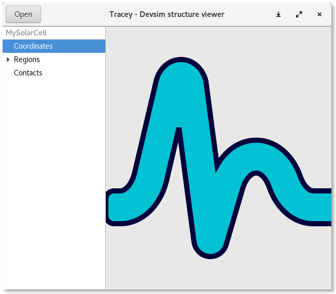
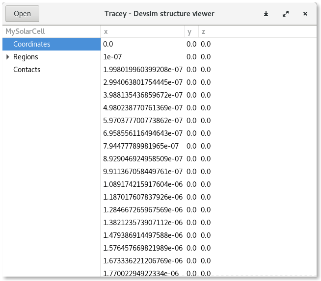

# Tracey

Tracey is a tool to visualize and inspect data exported by the [devsim](https://www.devsim.org/) TCAD simulator.

Tracey was developed by Noe Nieto as a by-product of the [GSOC 2018 for devsim](https://github.com/misaelnieto/devsim_gsoc_2018).

## Installation

Tracey uses pygobject and Gtk+3, so you will need to install the library according to the [pygobject installation instructions](https://pygobject.readthedocs.io/en/latest/getting_started.html).

Clone this repo in your machine.

    git clone git@github.com:misaelnieto/tracey.git

Enter the cloned folder

    cd tracey

Run the script

    python3 tracey.py

## Usage

Click con the open button and select the data file. Optionally you can especify the path to the file in the command line like this:

    python3 tracey.py path/to/devism_datafile.dat

## Status

As of now, tracey can list the regions, nodes, node solutions and edge solutions and the data is only shown as a datagrid.

## Further work

- Display the mesh and add 1D, 2D and 3D graphics using matplotlib.
- Export plots to png or svg.

